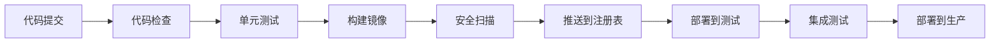

# CI/CD流水线与自动化部署学习笔记 - 2026-03-12

## 1. CI/CD概述

### 什么是CI/CD？
- **持续集成 (Continuous Integration)**：开发人员频繁地将代码集成到共享仓库，每次集成都通过自动化构建和测试验证
- **持续交付 (Continuous Delivery)**：自动化地将代码变更部署到测试或生产环境
- **持续部署 (Continuous Deployment)**：自动化地将通过测试的代码部署到生产环境

### CI/CD的价值
1. **快速反馈**：立即发现集成问题
2. **减少风险**：小批量频繁部署，降低故障影响
3. **提高质量**：自动化测试确保代码质量
4. **加速发布**：从几周到几分钟的部署周期

## 2. CI/CD工具比较

### GitHub Actions
```yaml
# .github/workflows/ci.yml
name: CI Pipeline
on: [push, pull_request]
jobs:
  test:
    runs-on: ubuntu-latest
    steps:
      - uses: actions/checkout@v4
      - uses: actions/setup-python@v5
        with:
          python-version: '3.12'
      - run: pip install -r requirements.txt
      - run: pytest
```

**优势**：
- 与GitHub深度集成
- 免费额度充足
- 丰富的Action市场
- 易于配置

### GitLab CI
```yaml
# .gitlab-ci.yml
stages:
  - test
  - build
  - deploy

test:
  stage: test
  image: python:3.12-slim
  script:
    - pip install -r requirements.txt
    - pytest
```

**优势**：
- 一体化平台
- 强大的流水线功能
- 自托管选项
- 容器原生

### Jenkins
```groovy
// Jenkinsfile
pipeline {
    agent any
    stages {
        stage('Test') {
            steps {
                sh 'pip install -r requirements.txt'
                sh 'pytest'
            }
        }
    }
}
```

**优势**：
- 高度可定制
- 丰富的插件生态
- 企业级功能
- 成熟稳定

## 3. 容器化CI/CD流水线设计

### 流水线阶段


### 完整CI/CD流水线配置
```yaml
# .github/workflows/techart-ci-cd.yml
name: TechArt CI/CD Pipeline

on:
  push:
    branches: [ main, develop ]
  pull_request:
    branches: [ main ]

env:
  REGISTRY: ghcr.io
  IMAGE_NAME: ${{ github.repository }}

jobs:
  # 阶段1: 代码质量和测试
  test:
    runs-on: ubuntu-latest
    steps:
      - name: Checkout code
        uses: actions/checkout@v4
      
      - name: Set up Python
        uses: actions/setup-python@v5
        with:
          python-version: '3.12'
      
      - name: Install dependencies
        run: |
          python -m pip install --upgrade pip
          pip install -r requirements.txt
          pip install pytest pytest-cov black flake8
      
      - name: Code formatting check
        run: black --check .
      
      - name: Lint code
        run: flake8 .
      
      - name: Run tests
        run: pytest --cov=./ --cov-report=xml
      
      - name: Upload coverage
        uses: codecov/codecov-action@v3
        with:
          file: ./coverage.xml
          flags: unittests

  # 阶段2: 构建和推送Docker镜像
  build-and-push:
    needs: test
    runs-on: ubuntu-latest
    permissions:
      contents: read
      packages: write
    steps:
      - name: Checkout code
        uses: actions/checkout@v4
      
      - name: Set up Docker Buildx
        uses: docker/setup-buildx-action@v3
      
      - name: Log in to Container Registry
        uses: docker/login-action@v3
        with:
          registry: ${{ env.REGISTRY }}
          username: ${{ github.actor }}
          password: ${{ secrets.GITHUB_TOKEN }}
      
      - name: Extract metadata
        id: meta
        uses: docker/metadata-action@v5
        with:
          images: ${{ env.REGISTRY }}/${{ env.IMAGE_NAME }}
          tags: |
            type=ref,event=branch
            type=ref,event=pr
            type=semver,pattern={{version}}
            type=semver,pattern={{major}}.{{minor}}
            type=sha,prefix={{branch}}-
      
      - name: Build and push Docker image
        uses: docker/build-push-action@v5
        with:
          context: .
          file: ./Dockerfile.techart
          push: ${{ github.event_name != 'pull_request' }}
          tags: ${{ steps.meta.outputs.tags }}
          labels: ${{ steps.meta.outputs.labels }}
          cache-from: type=gha
          cache-to: type=gha,mode=max

  # 阶段3: 安全扫描
  security-scan:
    needs: build-and-push
    runs-on: ubuntu-latest
    steps:
      - name: Checkout code
        uses: actions/checkout@v4
      
      - name: Run Trivy vulnerability scanner
        uses: aquasecurity/trivy-action@master
        with:
          scan-type: 'fs'
          scan-ref: '.'
          format: 'sarif'
          output: 'trivy-results.sarif'
      
      - name: Upload Trivy scan results
        uses: github/codeql-action/upload-sarif@v2
        with:
          sarif_file: 'trivy-results.sarif'

  # 阶段4: 部署到测试环境
  deploy-test:
    needs: security-scan
    runs-on: ubuntu-latest
    environment: test
    steps:
      - name: Deploy to test environment
        run: |
          echo "Deploying to test environment..."
          # 这里添加实际的部署命令
          # 例如: kubectl apply -f k8s/
          # 或: docker-compose -f docker-compose.test.yml up -d

  # 阶段5: 集成测试
  integration-test:
    needs: deploy-test
    runs-on: ubuntu-latest
    environment: test
    steps:
      - name: Run integration tests
        run: |
          echo "Running integration tests..."
          # 这里添加集成测试命令
          # 例如: curl测试API端点
          # 或: 运行端到端测试

  # 阶段6: 部署到生产环境
  deploy-prod:
    needs: integration-test
    if: github.event_name == 'push' && github.ref == 'refs/heads/main'
    runs-on: ubuntu-latest
    environment: production
    steps:
      - name: Deploy to production
        run: |
          echo "Deploying to production..."
          # 这里添加生产环境部署命令
          # 通常需要人工批准或蓝绿部署
```

## 4. 多环境部署策略

### 环境配置
```yaml
# 环境特定的配置
开发环境: 自动部署，宽松检查
测试环境: 自动部署，完整测试
预生产环境: 手动触发，生产配置
生产环境: 手动批准，蓝绿部署
```

### 蓝绿部署策略
```bash
# 蓝绿部署流程
1. 部署新版本（绿环境）
2. 运行健康检查
3. 切换流量到绿环境
4. 监控新版本表现
5. 回滚或清理蓝环境
```

## 5. 监控和告警集成

### 流水线监控
```yaml
# 监控配置
成功指标:
  - 构建成功率 > 95%
  - 测试通过率 > 90%
  - 部署成功率 > 99%
  - 平均构建时间 < 10分钟

告警规则:
  - 构建失败时通知
  - 测试覆盖率下降时通知
  - 安全漏洞发现时通知
  - 部署失败时通知
```

### 集成外部监控
```yaml
# 与外部工具集成
- Prometheus: 收集指标
- Grafana: 可视化仪表板
- Slack/Teams: 通知
- Sentry: 错误跟踪
- New Relic: 应用性能监控
```

## 6. 安全最佳实践

### 安全流水线
```yaml
安全检查阶段:
  1. 依赖漏洞扫描
  2. 容器镜像扫描
  3. 静态代码分析
  4. 动态应用测试
  5. 秘密检测
```

### 秘密管理
```yaml
# 使用GitHub Secrets或外部秘密管理
敏感信息:
  - API密钥
  - 数据库密码
  - SSH密钥
  - 证书文件

最佳实践:
  - 永远不将秘密提交到代码库
  - 使用环境变量或秘密管理工具
  - 定期轮换秘密
  - 最小权限原则
```

## 7. 性能优化

### 缓存策略
```yaml
# CI/CD缓存配置
缓存项目:
  - 依赖包 (pip, npm, etc.)
  - Docker层缓存
  - 构建工具缓存
  - 测试结果缓存

缓存策略:
  - 使用共享缓存
  - 设置合理的过期时间
  - 清理无用缓存
```

### 并行执行
```yaml
# 并行作业配置
并行作业:
  - 单元测试
  - 集成测试
  - 代码质量检查
  - 安全扫描

优化策略:
  - 根据依赖关系安排作业顺序
  - 使用更快的运行器
  - 减少不必要的步骤
```

## 8. 应用到TechArt资源收集器

### 简化CI/CD配置
```yaml
# .github/workflows/techart-simple.yml
name: TechArt Simple CI

on: [push, pull_request]

jobs:
  test:
    runs-on: ubuntu-latest
    steps:
      - uses: actions/checkout@v4
      - uses: actions/setup-python@v5
        with:
          python-version: '3.12'
      - run: pip install -r requirements.txt
      - run: python -m pytest

  build:
    needs: test
    runs-on: ubuntu-latest
    steps:
      - uses: actions/checkout@v4
      - name: Build Docker image
        run: docker build -f Dockerfile.techart -t techart-collector .
```

### 部署脚本
```bash
#!/bin/bash
# deploy.sh - TechArt收集器部署脚本

set -e

ENVIRONMENT=${1:-development}

echo "部署TechArt收集器到 $ENVIRONMENT 环境"

case $ENVIRONMENT in
  development)
    docker-compose -f docker-compose.yml -f docker-compose.dev.yml up -d
    ;;
  test)
    docker-compose -f docker-compose.yml -f docker-compose.test.yml up -d
    ;;
  production)
    docker-compose -f docker-compose.yml -f docker-compose.prod.yml up -d
    ;;
  *)
    echo "未知环境: $ENVIRONMENT"
    exit 1
    ;;
esac

echo "部署完成"
```

## 9. 故障排除和调试

### 常见问题
```yaml
问题1: 构建失败
  原因: 依赖问题或配置错误
  解决: 检查错误日志，更新依赖

问题2: 测试失败
  原因: 代码变更或环境问题
  解决: 本地重现，修复测试

问题3: 部署失败
  原因: 配置错误或资源不足
  解决: 检查配置，增加资源

问题4: 性能下降
  原因: 缓存失效或资源竞争
  解决: 优化缓存，调整资源
```

### 调试工具
```bash
# 调试命令
# 查看流水线日志
gh run view --log

# 本地测试CI步骤
act -j test

# 检查Docker构建
docker build --no-cache -f Dockerfile.techart .

# 测试部署脚本
bash -x deploy.sh development
```

## 10. 实施路线图

### 阶段1: 基础CI（1周）
1. 设置GitHub Actions基础配置
2. 实现代码检查和测试
3. 配置基本通知

### 阶段2: 容器化CI（1周）
1. 集成Docker构建
2. 添加安全扫描
3. 配置多环境部署

### 阶段3: 完整CD（2周）
1. 实现自动化部署
2. 集成监控和告警
3. 优化性能和可靠性

### 阶段4: 高级功能（可选）
1. 蓝绿部署
2. 金丝雀发布
3. 自动回滚

## 总结

CI/CD是现代软件开发的核心实践，通过自动化构建、测试和部署，可以显著提高开发效率、代码质量和发布速度。对于TechArt资源收集器，实施CI/CD可以：

1. **确保代码质量**：自动化测试和代码检查
2. **加速发布周期**：从手动部署到自动部署
3. **提高可靠性**：标准化部署流程，减少人为错误
4. **增强安全性**：集成安全扫描和秘密管理

建议从简单的CI流水线开始，逐步扩展到完整的CD流水线，最终实现完全自动化的部署流程。