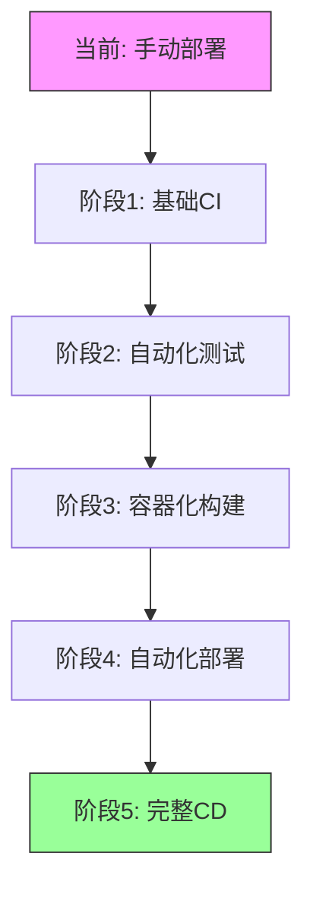

# CI/CD实施中的常见问题与解决方案分析 - 2026-03-12

## 问题概述

在实施CI/CD流水线时，团队通常会遇到各种技术和流程问题。这些问题可能导致构建失败、部署延迟、质量下降等。本文档分析TechArt资源收集器CI/CD实施中可能遇到的问题，并提供解决方案。

## 1. 构建阶段问题

### 问题1: 依赖安装失败
```yaml
# 错误示例
ERROR: Could not find a version that satisfies the requirement aiohttp==3.9.0
ERROR: No matching distribution found for aiohttp==3.9.0
```

**原因分析**：
1. Python包索引不可用或网络问题
2. 包版本不存在或已删除
3. 平台或Python版本不兼容

**解决方案**：
```yaml
# 1. 使用国内镜像源（针对中国用户）
- name: Install dependencies with mirror
  run: |
    pip config set global.index-url https://pypi.tuna.tsinghua.edu.cn/simple
    pip install -r requirements.txt

# 2. 添加重试机制
- name: Install dependencies with retry
  run: |
    for i in {1..3}; do
      pip install -r requirements.txt && break
      echo "Attempt $i failed, retrying in 5 seconds..."
      sleep 5
    done

# 3. 使用宽松版本约束
# requirements.txt修改为：
aiohttp>=3.8.0,<4.0.0
requests>=2.28.0
```

### 问题2: 测试不稳定（Flaky Tests）
```yaml
# 错误示例
FAILED tests/test_async.py::test_fetch_url - TimeoutError
FAILED tests/test_async.py::test_fetch_url - AssertionError
```

**原因分析**：
1. 网络依赖导致超时
2. 异步测试时序问题
3. 测试环境状态依赖

**解决方案**：
```yaml
# 1. 使用测试重试
- name: Run tests with retry
  run: |
    pytest --reruns 3 --reruns-delay 2

# 2. 模拟外部依赖
# 使用pytest-mock或unittest.mock
@pytest.fixture
def mock_session(mocker):
    return mocker.patch('aiohttp.ClientSession')

# 3. 增加超时时间
@pytest.mark.asyncio
@pytest.mark.timeout(30)  # 30秒超时
async def test_slow_operation():
    await asyncio.sleep(20)
```

### 问题3: 构建时间过长
```yaml
# 问题表现
构建时间: 15分钟+
Docker构建: 8分钟+
测试执行: 5分钟+
```

**原因分析**：
1. 未使用缓存
2. 并行化不足
3. 不必要的步骤

**解决方案**：
```yaml
# 1. 启用缓存
- name: Cache pip packages
  uses: actions/cache@v3
  with:
    path: ~/.cache/pip
    key: ${{ runner.os }}-pip-${{ hashFiles('requirements.txt') }}
    restore-keys: |
      ${{ runner.os }}-pip-

# 2. 使用Docker构建缓存
- name: Build with cache
  uses: docker/build-push-action@v4
  with:
    cache-from: type=gha
    cache-to: type=gha,mode=max

# 3. 并行执行作业
jobs:
  lint:
    runs-on: ubuntu-latest
  test:
    runs-on: ubuntu-latest
  build:
    runs-on: ubuntu-latest
    needs: [lint, test]  # 并行执行lint和test
```

## 2. 部署阶段问题

### 问题4: 环境配置不一致
```yaml
# 问题表现
开发环境: 工作正常
测试环境: 配置缺失
生产环境: 权限错误
```

**原因分析**：
1. 硬编码配置值
2. 环境变量未正确设置
3. 秘密管理不当

**解决方案**：
```yaml
# 1. 使用环境特定的配置文件
# config/
#   ├── development.yaml
#   ├── test.yaml
#   └── production.yaml

# 2. GitHub环境变量和秘密
- name: Deploy with environment variables
  run: |
    export DATABASE_URL=${{ secrets.DATABASE_URL }}
    export API_KEY=${{ secrets.API_KEY }}
    ./deploy.sh

# 3. 配置验证
- name: Validate configuration
  run: |
    python -c "
    import os
    required_vars = ['DATABASE_URL', 'API_KEY']
    missing = [var for var in required_vars if not os.getenv(var)]
    if missing:
        print(f'Missing environment variables: {missing}')
        exit(1)
    "
```

### 问题5: 数据库迁移失败
```yaml
# 错误示例
ERROR: relation "users" already exists
ERROR: column "email" cannot be cast automatically to type text
```

**原因分析**：
1. 迁移脚本冲突
2. 数据库状态不一致
3. 迁移顺序错误

**解决方案**：
```yaml
# 1. 自动化迁移检查
- name: Check database migrations
  run: |
    # 检查是否有未应用的迁移
    python manage.py makemigrations --check --dry-run
    
    # 应用迁移前备份
    pg_dump -U $DB_USER $DB_NAME > backup.sql

# 2. 使用事务性迁移
# 在迁移文件中使用atomic操作
from django.db import migrations, transaction

class Migration(migrations.Migration):
    atomic = True
    
    def migrate(self):
        with transaction.atomic():
            # 迁移操作

# 3. 回滚策略
- name: Deploy with rollback
  run: |
    # 蓝绿部署或金丝雀发布
    ./deploy.sh --strategy=blue-green
```

### 问题6: 服务启动失败
```yaml
# 错误示例
ERROR: Container techart-collector exited with code 1
ERROR: Health check failed
```

**原因分析**：
1. 资源不足（内存、CPU）
2. 端口冲突
3. 依赖服务未就绪

**解决方案**：
```yaml
# 1. 健康检查和就绪检查
# Docker Compose配置
healthcheck:
  test: ["CMD", "curl", "-f", "http://localhost:8000/health"]
  interval: 30s
  timeout: 10s
  retries: 3
  start_period: 40s

# 2. 资源限制和请求
deploy:
  resources:
    limits:
      cpus: '1.0'
      memory: 512M
    reservations:
      cpus: '0.5'
      memory: 256M

# 3. 依赖等待脚本
- name: Wait for dependencies
  run: |
    # 等待数据库就绪
    ./wait-for-it.sh postgres:5432 --timeout=30
    
    # 等待Redis就绪
    ./wait-for-it.sh redis:6379 --timeout=30
```

## 3. 安全和合规问题

### 问题7: 秘密泄露风险
```yaml
# 风险示例
# 错误地将秘密提交到代码库
# 在日志中输出敏感信息
# 使用不安全的秘密存储
```

**解决方案**：
```yaml
# 1. 使用GitHub Secrets
- name: Use secrets securely
  env:
    DATABASE_PASSWORD: ${{ secrets.DATABASE_PASSWORD }}
    API_KEY: ${{ secrets.API_KEY }}
  run: |
    echo "Database password length: ${#DATABASE_PASSWORD}"
    # 不直接输出秘密

# 2. 秘密扫描
- name: Secret scanning
  uses: gitleaks/gitleaks-action@v2
  with:
    config-path: .gitleaks.toml

# 3. 轮换秘密
- name: Rotate secrets
  run: |
    # 定期自动轮换秘密
    ./rotate-secrets.sh
```

### 问题8: 合规性检查失败
```yaml
# 合规问题
许可证检查失败
安全策略违规
代码规范不符合
```

**解决方案**：
```yaml
# 1. 自动化合规检查
- name: License compliance
  uses: fossa-contrib/fossa-action@v2
  with:
    fossa-api-key: ${{ secrets.FOSSA_API_KEY }}

- name: Security policy check
  uses: step-security/harden-runner@v2
  with:
    egress-policy: audit

# 2. 代码规范检查
- name: Code standards
  run: |
    # 检查代码规范
    black --check .
    flake8 .
    mypy --strict .

# 3. 文档完整性检查
- name: Documentation check
  run: |
    # 检查必要的文档
    test -f README.md && echo "README exists"
    test -f SECURITY.md && echo "SECURITY policy exists"
    test -f CONTRIBUTING.md && echo "CONTRIBUTING guide exists"
```

## 4. 监控和运维问题

### 问题9: 缺乏有效的监控
```yaml
# 监控缺失
构建失败无通知
部署状态不透明
性能指标缺失
```

**解决方案**：
```yaml
# 1. 集成监控工具
- name: Send metrics to Prometheus
  run: |
    # 推送构建指标
    echo "ci_build_duration_seconds $(($(date +%s) - START_TIME))" | \
      curl --data-binary @- http://prometheus:9091/metrics/job/ci

# 2. 实时通知
- name: Notify on failure
  uses: 8398a7/action-slack@v3
  if: failure()
  with:
    channel: '#ci-alerts'
    username: 'CI Bot'
  env:
    SLACK_WEBHOOK_URL: ${{ secrets.SLACK_WEBHOOK_URL }}

# 3. 仪表板集成
- name: Update deployment dashboard
  run: |
    # 更新Grafana或类似仪表板
    curl -X POST https://grafana/api/dashboards/db \
      -H "Authorization: Bearer ${{ secrets.GRAFANA_TOKEN }}" \
      -d @deployment-metrics.json
```

### 问题10: 回滚机制不完善
```yaml
# 回滚问题
回滚过程手动且容易出错
回滚后状态不一致
缺乏回滚测试
```

**解决方案**：
```yaml
# 1. 自动化回滚策略
- name: Automated rollback
  if: failure()
  run: |
    # 自动回滚到上一个稳定版本
    ./rollback.sh --version=previous-stable
    
    # 验证回滚成功
    ./health-check.sh --timeout=60

# 2. 蓝绿部署支持
strategy:
  type: blue-green
  blue:
    replicas: 2
  green:
    replicas: 2
  autoPromotion: false  # 手动确认后切换

# 3. 回滚测试
- name: Test rollback procedure
  run: |
    # 定期测试回滚流程
    ./test-rollback.sh --environment=staging
```

## 5. 团队协作问题

### 问题11: 流水线配置冲突
```yaml
# 配置冲突
多人修改同一流水线文件
配置合并冲突
环境配置不一致
```

**解决方案**：
```yaml
# 1. 模块化配置
# .github/workflows/
#   ├── templates/
#   │   ├── build.yml
#   │   ├── test.yml
#   │   └── deploy.yml
#   └── ci.yml  # 引用模板

# 2. 配置验证
- name: Validate workflow configuration
  uses: actions/github-script@v6
  with:
    script: |
      // 验证YAML语法和结构
      const yaml = require('js-yaml');
      const fs = require('fs');
      try {
        const doc = yaml.load(fs.readFileSync('.github/workflows/ci.yml', 'utf8'));
        console.log('Workflow configuration is valid');
      } catch (e) {
        core.setFailed(`Invalid workflow configuration: ${e.message}`);
      }

# 3. 配置审查
# 要求代码审查流水线更改
# 使用保护分支规则
```

### 问题12: 知识共享不足
```yaml
# 知识孤岛
只有少数人了解完整流水线
缺乏文档和培训
问题解决依赖特定人员
```

**解决方案**：
```yaml
# 1. 文档自动化
- name: Generate pipeline documentation
  run: |
    # 自动生成流水线文档
    python generate-docs.py --workflow .github/workflows/
    
    # 发布到内部Wiki或文档站点
    ./publish-docs.sh

# 2. 定期培训和工作坊
# 每月举行CI/CD工作坊
# 新成员入职培训包含流水线介绍

# 3. 共享运行簿（Runbook）
# 创建常见问题的解决指南
# 维护故障排除文档
```

## 6. 针对TechArt资源收集器的具体解决方案

### 简化版CI/CD配置
```yaml
# .github/workflows/techart-simple.yml
name: TechArt Simple CI/CD

on: [push]

jobs:
  quality:
    runs-on: ubuntu-latest
    steps:
      - uses: actions/checkout@v4
      - uses: actions/setup-python@v5
        with:
          python-version: '3.12'
      - run: pip install -r requirements.txt
      - run: python -m pytest --tb=short

  build:
    needs: quality
    runs-on: ubuntu-latest
    steps:
      - uses: actions/checkout@v4
      - run: docker build -f Dockerfile.techart -t techart-collector .

  deploy:
    needs: build
    if: github.ref == 'refs/heads/main'
    runs-on: ubuntu-latest
    steps:
      - name: Simple deployment
        run: |
          echo "Deploying TechArt Collector..."
          # 简单的部署逻辑
          ./deploy-simple.sh
```

### 渐进式改进计划


### 监控和告警配置
```yaml
# 基础监控配置
监控项:
  - 构建成功率
  - 测试通过率
  - 部署成功率
  - 构建时间
  - 资源使用

告警阈值:
  - 构建成功率 < 90%
  - 测试通过率 < 85%
  - 部署失败 > 3次
  - 构建时间 > 10分钟
```

## 7. 实施建议

### 短期建议（1-2周）
1. **实施基础CI**：代码检查、单元测试、简单构建
2. **建立监控基线**：收集关键指标，设置基础告警
3. **创建文档**：流水线配置、故障排除指南

### 中期建议（1-2月）
1. **完善测试套件**：集成测试、端到端测试
2. **自动化部署**：测试环境自动部署，生产环境半自动
3. **安全加固**：秘密管理、漏洞扫描、合规检查

### 长期建议（3-6月）
1. **完整CD流水线**：蓝绿部署、自动回滚、金丝雀发布
2. **高级监控**：性能分析、成本优化、预测性告警
3. **团队赋能**：培训、知识共享、自助服务

## 总结

CI/CD实施是一个渐进的过程，需要平衡自动化程度、复杂性和团队能力。对于TechArt资源收集器，建议：

1. **从简单开始**：先实现基础CI，再逐步扩展
2. **关注价值**：优先解决最影响效率和质量的问题
3. **持续改进**：定期回顾和优化流水线
4. **团队协作**：确保整个团队理解和参与CI/CD流程

通过系统化地识别和解决CI/CD实施中的问题，可以构建出高效、可靠、安全的自动化流水线，显著提升TechArt资源收集器的开发效率和部署质量。