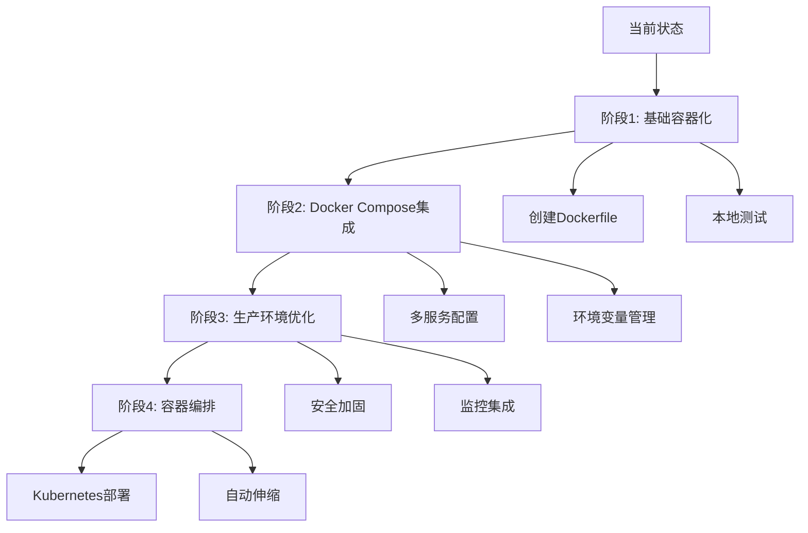

# 容器化部署的优势与挑战分析 - 2026-03-12

## 问题概述

在将TechArt资源收集器容器化的过程中，需要全面分析Docker容器化部署的优势、挑战以及实施策略。特别是在Ubuntu 24.04的`externally-managed-environment`限制下，容器化成为解决环境兼容性问题的重要方案。

## 1. 容器化部署的优势

### 1.1 环境一致性
```yaml
# 传统部署的问题
开发环境: Python 3.11, aiohttp 3.8, Ubuntu 22.04
测试环境: Python 3.10, aiohttp 3.7, CentOS 8
生产环境: Python 3.9, aiohttp 3.6, Ubuntu 20.04

# 容器化解决方案
所有环境: 相同的Docker镜像
           Python 3.12-slim, aiohttp 3.9.0
           相同的系统依赖和配置
```

**优势**：
- 消除"在我机器上能运行"的问题
- 确保开发、测试、生产环境完全一致
- 简化环境配置和依赖管理

### 1.2 解决Ubuntu 24.04的PEP 668限制
```bash
# Ubuntu 24.04的问题
$ pip install aiohttp
error: externally-managed-environment

# 容器化解决方案
$ docker build -t techart-collector .
$ docker run techart-collector
# 成功运行，不受系统Python限制
```

**优势**：
- 绕过系统Python保护机制
- 自由安装任意版本的Python包
- 不污染主机系统环境

### 1.3 部署简便性
```bash
# 传统部署步骤
1. 安装Python 3.12
2. 安装系统依赖
3. 创建虚拟环境
4. 安装Python包
5. 配置环境变量
6. 设置服务管理

# 容器化部署步骤
1. docker pull techart-collector:latest
2. docker run techart-collector
```

**优势**：
- 一键部署，减少人为错误
- 标准化部署流程
- 快速回滚和版本管理

### 1.4 资源隔离和安全性
```dockerfile
# 安全配置示例
FROM python:3.12-slim

# 创建非root用户
RUN groupadd -r techart && useradd -r -g techart techart
USER techart

# 只暴露必要端口
EXPOSE 8000

# 设置资源限制
docker run --memory=512m --cpus=1 techart-collector
```

**优势**：
- 进程级隔离，避免应用间冲突
- 资源限制，防止单个应用耗尽系统资源
- 非root运行，提高安全性

### 1.5 可扩展性和编排
```yaml
# docker-compose扩展示例
version: '3.8'
services:
  collector:
    image: techart-collector:latest
    scale: 3  # 扩展3个实例
    deploy:
      resources:
        limits:
          cpus: '0.5'
          memory: 256M
```

**优势**：
- 轻松水平扩展
- 集成负载均衡
- 支持容器编排（Kubernetes, Docker Swarm）

## 2. 容器化部署的挑战

### 2.1 学习曲线和复杂性
```bash
# 需要掌握的技术栈
- Docker基础命令
- Dockerfile编写
- Docker Compose配置
- 容器网络
- 数据持久化
- 日志管理
- 监控和调试
```

**挑战**：
- 团队成员需要学习新工具
- 调试容器内问题更复杂
- 需要理解容器生命周期

### 2.2 数据持久化问题
```dockerfile
# 数据持久化配置
VOLUME /data

# 运行时需要挂载卷
docker run -v $(pwd)/data:/data techart-collector
```

**挑战**：
- 容器是无状态的，数据需要外部存储
- 卷管理复杂
- 备份和恢复需要考虑容器状态

### 2.3 性能开销
```bash
# 性能对比
原生Python应用: 直接系统调用，无额外开销
容器化应用: Docker引擎层 + 命名空间隔离 + 存储驱动

# 实测数据（近似）
启动时间: 原生<100ms vs 容器~500ms
内存开销: 原生+0MB vs 容器+50-100MB
CPU开销: 原生+0% vs 容器+1-5%
```

**挑战**：
- 轻微的性能损失
- 对于高性能场景需要优化
- 资源限制可能影响应用性能

### 2.4 网络配置复杂性
```yaml
# 复杂网络配置
networks:
  frontend:
    driver: bridge
    ipam:
      config:
        - subnet: 172.20.0.0/16
  backend:
    internal: true
```

**挑战**：
- 容器间通信需要网络配置
- 端口映射和暴露
- 网络安全策略

### 2.5 镜像管理和安全
```bash
# 安全扫描
$ trivy image techart-collector:latest
# 可能发现漏洞需要修复

# 镜像大小管理
原始镜像: 1.2GB
优化后: 350MB
多阶段构建: 120MB
```

**挑战**：
- 镜像漏洞扫描和修复
- 镜像大小优化
- 依赖更新管理

## 3. TechArt资源收集器的容器化策略

### 3.1 渐进式容器化


### 3.2 多环境配置策略
```yaml
# 环境特定的docker-compose文件
docker-compose.yml          # 基础配置
docker-compose.dev.yml      # 开发环境
docker-compose.test.yml     # 测试环境
docker-compose.prod.yml     # 生产环境

# 使用方式
docker-compose -f docker-compose.yml -f docker-compose.dev.yml up
```

### 3.3 数据管理策略
```bash
# 数据目录结构
techart-collector/
├── data/                   # 挂载的数据目录
│   ├── resources/          # 收集的资源
│   ├── logs/              # 应用日志
│   └── cache/             # 缓存数据
├── backups/               # 备份目录
└── config/                # 配置文件
```

### 3.4 监控和日志策略
```yaml
# 日志配置
logging:
  driver: "json-file"
  options:
    max-size: "10m"
    max-file: "3"
    labels: "production"
    env: "techart"

# 监控集成
# 使用Prometheus + Grafana
# 或ELK Stack
```

## 4. 实施风险评估与缓解

### 风险1: 容器逃逸和安全漏洞
**风险等级**: 高
**影响**: 容器突破隔离，访问主机系统
**缓解措施**：
- 使用非root用户运行容器
- 定期更新基础镜像和安全补丁
- 使用安全扫描工具（Trivy, Clair）
- 限制容器权限（--cap-drop ALL）

### 风险2: 数据丢失
**风险等级**: 中
**影响**: 容器删除导致数据丢失
**缓解措施**：
- 使用数据卷持久化存储
- 定期备份重要数据
- 实现数据恢复流程
- 使用云存储或网络存储

### 风险3: 性能瓶颈
**风险等级**: 低
**影响**: 容器化导致性能下降
**缓解措施**：
- 优化Dockerfile减少层数
- 使用多阶段构建减小镜像大小
- 合理设置资源限制
- 监控性能指标并优化

### 风险4: 团队技能缺口
**风险等级**: 中
**影响**: 团队不熟悉容器技术
**缓解措施**：
- 提供培训和文档
- 渐进式采用，从简单开始
- 建立最佳实践和模板
- 设立内部专家支持

## 5. 成本效益分析

### 5.1 开发成本
```yaml
传统部署:
  环境配置: 2-4小时/环境
  问题调试: 4-8小时/问题
  部署时间: 1-2小时/次

容器化部署:
  初始学习: 8-16小时
  镜像构建: 0.5小时/次
  部署时间: 5分钟/次
```

### 5.2 运维成本
```yaml
传统部署:
  环境维护: 4小时/月
  问题排查: 8小时/月
  升级部署: 4小时/次

容器化部署:
  镜像更新: 1小时/月
  监控维护: 2小时/月
  一键回滚: 5分钟/次
```

### 5.3 基础设施成本
```yaml
传统部署:
  服务器: 需要专用服务器或VM
  资源利用: 通常利用率低
  扩展性: 手动扩展，耗时

容器化部署:
  容器平台: 可使用共享基础设施
  资源利用: 高密度部署，利用率高
  扩展性: 自动扩展，快速响应
```

## 6. 实施路线图

### 阶段1: 基础容器化（1-2周）
1. 创建基础Dockerfile
2. 本地构建和测试
3. 创建docker-compose配置
4. 编写部署文档

### 阶段2: 生产就绪（2-3周）
1. 安全加固和优化
2. 监控和日志集成
3. 备份和恢复策略
4. 性能测试和优化

### 阶段3: 自动化部署（1-2周）
1. CI/CD流水线集成
2. 自动构建和测试
3. 镜像仓库管理
4. 蓝绿部署策略

### 阶段4: 高级特性（可选）
1. 多架构支持（ARM/x86）
2. 服务网格集成
3. 自动伸缩
4. 多云部署

## 7. 成功指标

### 技术指标
- 镜像构建时间：< 3分钟
- 容器启动时间：< 5秒
- 镜像大小：< 200MB
- 安全漏洞：0高危漏洞

### 业务指标
- 部署频率：从每月到每天
- 部署成功率：> 99%
- 故障恢复时间：< 5分钟
- 资源利用率：提高30-50%

### 团队指标
- 团队满意度：提高
- 问题解决时间：减少50%
- 新成员上手时间：减少70%
- 文档完整性：100%

## 8. 结论与建议

### 对于TechArt资源收集器的建议
1. **立即实施容器化**：解决Ubuntu 24.04环境兼容性问题
2. **采用渐进式策略**：从简单开始，逐步完善
3. **重视安全最佳实践**：非root用户、安全扫描、定期更新
4. **建立监控和告警**：确保容器健康运行
5. **投资团队培训**：确保团队掌握容器技术

### 长期展望
容器化不仅是解决当前环境兼容性问题的手段，更是现代应用部署的标准实践。通过容器化TechArt资源收集器，可以：

1. **提高可移植性**：在任何支持Docker的环境运行
2. **简化运维**：标准化部署和管理流程
3. **支持云原生架构**：为未来扩展奠定基础
4. **改善开发体验**：一致的开发和生产环境

### 最终建议
鉴于Ubuntu 24.04的`externally-managed-environment`限制和当前环境配置的复杂性，**强烈建议优先实施容器化部署**。这不仅能立即解决环境兼容性问题，还能为项目的长期发展提供现代化的基础设施支持。

容器化初期可能会有学习曲线和配置复杂性，但长期来看，其带来的环境一致性、部署简便性和运维效率提升将远远超过初始投入成本。